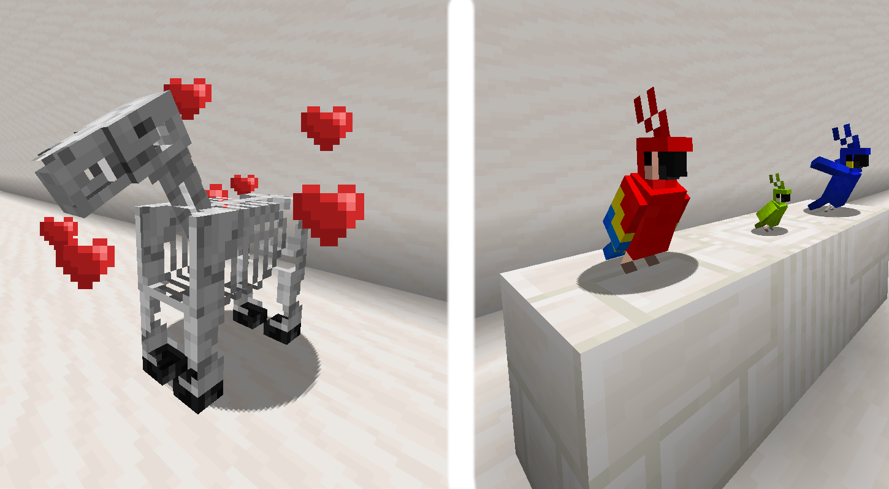

# Breed More Mobs

---

Breed More Mobs is a server-side mod that lets you breed mobs that can't be bred in vanilla.  
This mod also adds the ability to tame skeleton horses and zombie horses.  

| Entity         | Related Items      |
|----------------|--------------------|
| Parrot         | Seeds              |
| Polar Bear     | Fishes             |
| Skeleton Horse | Raw & Cooked Meats |
| Zombie Horse   | Raw & Cooked Meats |

Parrots and polar bears have been added to the **Two By Two** achievement, which now requires 27 mobs to complete.  

